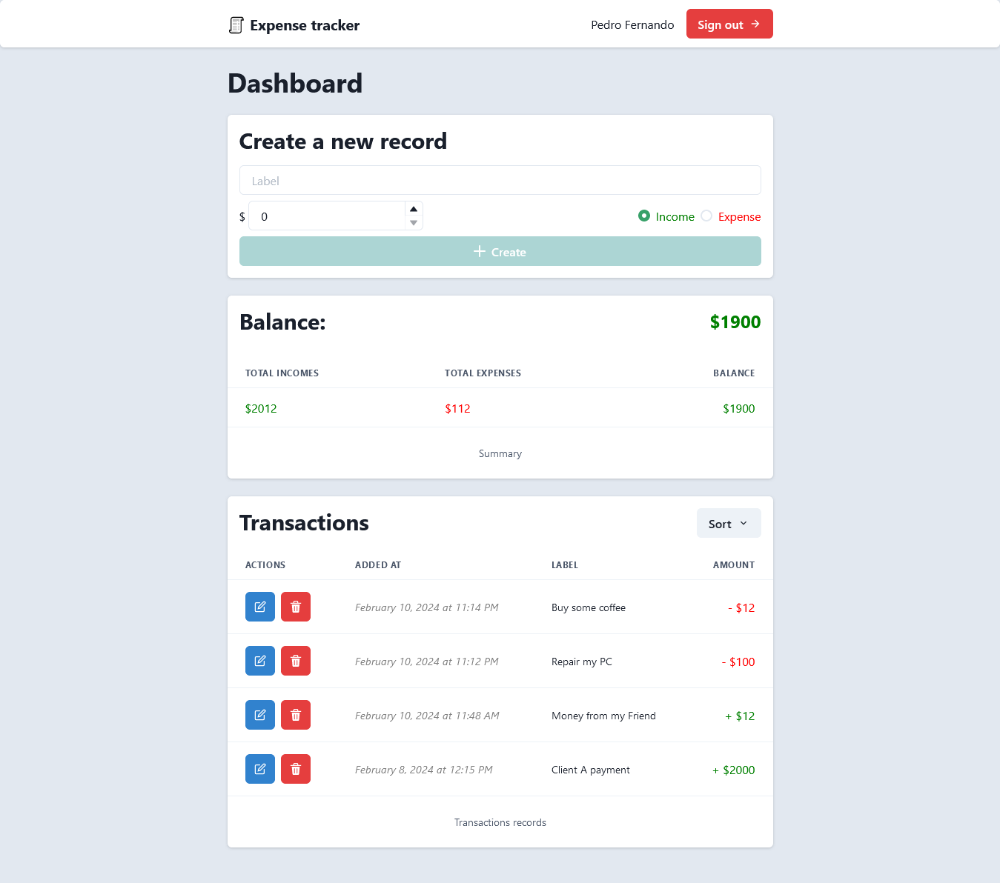

# Expense tracker

This is a small expense tracker app that I built using [React](https://fr.react.dev/), [Typescript](https://www.typescriptlang.org/), [Chakra UI](https://chakra-ui.com/), [Tanstack Query (react-query)](https://tanstack.com/query/v3/), [Zustand](https://zustand-demo.pmnd.rs/) and [Firebase](https://firebase.google.com/).

## Purpose

This is just a random small project idea for me to get started with using Firebase and specifically on the web.  
I've already went through quite a lot of concepts through building this project such as **authentication**, different types of queries to Firestore such as **simple queries**, **paginated queries**, **aggregated queries**, **writes operations**, with the **security rules** that go along with it, and also the setup of the [local Firebase emulator suite](https://firebase.google.com/docs/emulator-suite).  
Unfortunately, since I'm currently on the free plan, I've not been able to deploy any [Firebase cloud functions](https://firebase.google.com/docs/functions) yet but I'm looking forwards to use this feature in my susbequent Firebase projects to enable more backend capabilities.

## Preview

The application was deployed using [Firebase hosting](https://firebase.google.com/docs/hosting). You can view the application live [here](https://fir-demo-69f18.web.app/).

Here is a screenshot of the dashboard:

